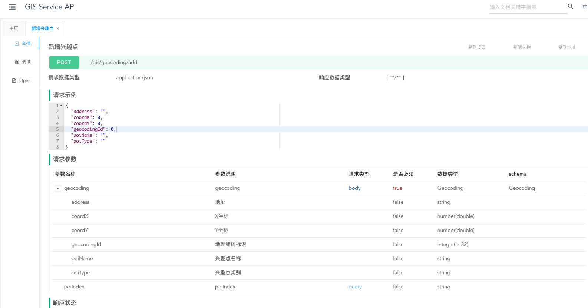
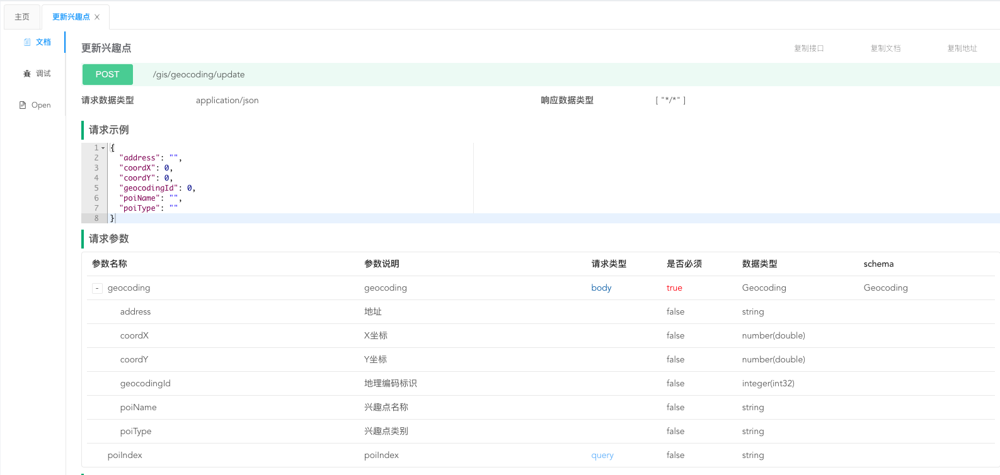
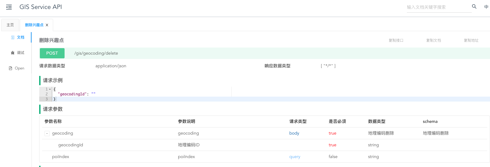
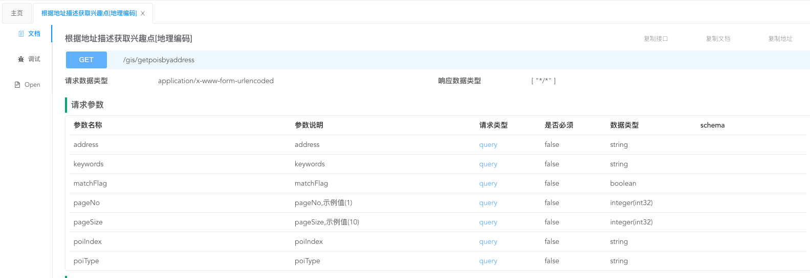

# 兴趣点管理相关接口

## 新增兴趣点

[/gis/geocoding/add](http://10.32.132.33:30003/doc.html#/1.3.0%E7%89%88%E6%9C%AC/%E5%85%B4%E8%B6%A3%E7%82%B9%E7%9B%B8%E5%85%B3%E6%8E%A5%E5%8F%A3/addPOIUsingPOST)

## 更新兴趣点

[/gis/geocoding/delete](http://10.32.132.33:30003/doc.html#/1.3.0%E7%89%88%E6%9C%AC/%E5%85%B4%E8%B6%A3%E7%82%B9%E7%9B%B8%E5%85%B3%E6%8E%A5%E5%8F%A3/updatePOIUsingPOST)

## 删除兴趣点

[/gis/geocoding/delete](http://10.32.132.33:30003/doc.html#/1.3.0%E7%89%88%E6%9C%AC/%E5%85%B4%E8%B6%A3%E7%82%B9%E7%9B%B8%E5%85%B3%E6%8E%A5%E5%8F%A3/deletePOIUsingPOST)

## 地址搜索

[/gis/getpoisbyaddress](http://10.32.132.33:30003/doc.html#/1.3.0%E7%89%88%E6%9C%AC/%E5%85%B4%E8%B6%A3%E7%82%B9%E7%9B%B8%E5%85%B3%E6%8E%A5%E5%8F%A3/getPoisByAddressUsingGET)

